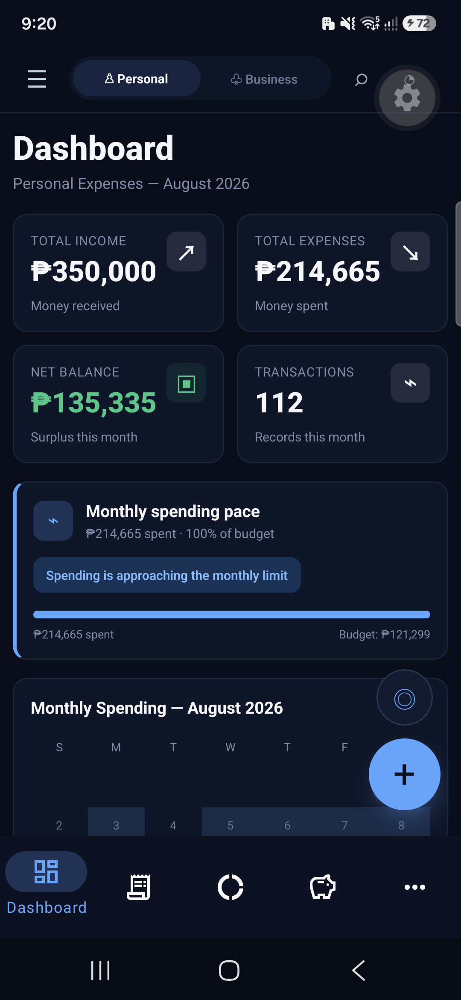
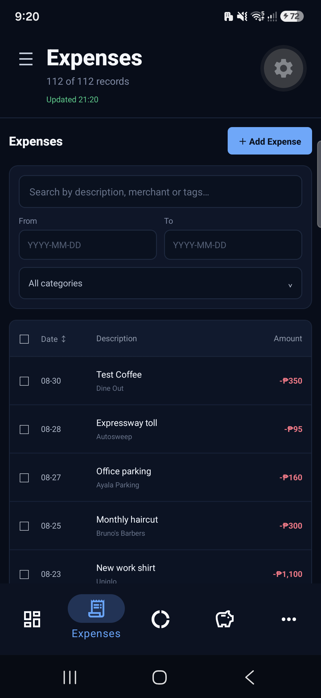
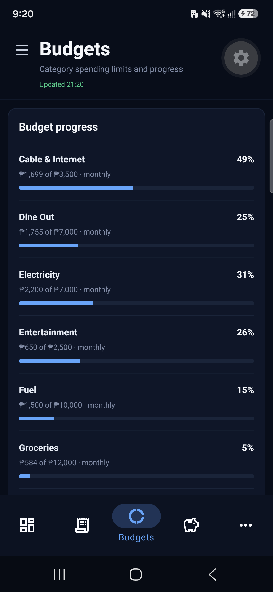
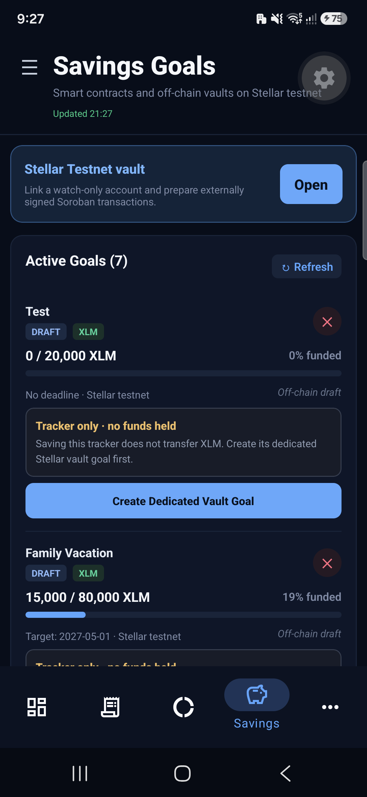
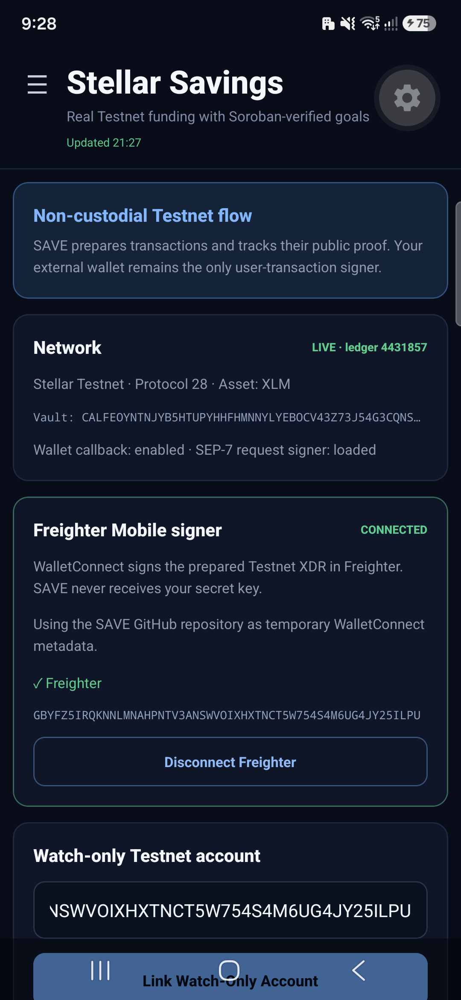
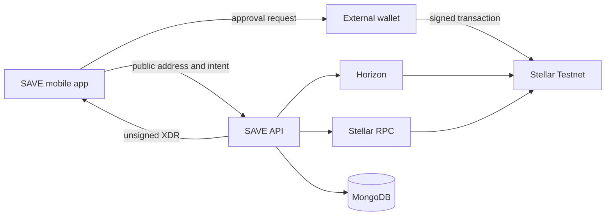

<p align="center">
  
</p>

# SAVE Finance

[](https://github.com/FWDP/save-project/actions/workflows/verify.yml)

### Personal finance and goal-based saving, with optional Stellar rails

Track spending. Plan budgets. Build savings on Stellar Testnet without giving up custody of your wallet.

SAVE brings everyday money management, receipt capture, savings goals, and externally signed Stellar transactions into one mobile-first workspace. A NestJS API supports the app, while a Next.js dashboard provides an operational view.

[Explore the repository](https://github.com/FWDP/save-project) · [Reviewer runbook](docs/REVIEWER_RUNBOOK.md) · [Stellar architecture](docs/STELLAR_ARCHITECTURE.md) · [Verification evidence](docs/DELIVERABLE_4_EVIDENCE.md)

> [!IMPORTANT]
> SAVE's blockchain features are alpha software for **Stellar Testnet only**. The project does not support Mainnet or real-value custody. SAVE never asks for or stores a wallet secret seed; an external wallet must approve every transaction.

---

## 📱 SAVE on Mobile

A tour of SAVE's mobile experience, from everyday money management to non-custodial Stellar Testnet savings. Screenshots show demo financial data from an Android development build.

<table>
  <tr>
    <th>Financial dashboard</th>
    <th>Expense tracking</th>
  </tr>
  <tr>
    <td></td>
    <td></td>
  </tr>
  <tr>
    <th>Budget progress</th>
    <th>Savings goals</th>
  </tr>
  <tr>
    <td></td>
    <td></td>
  </tr>
  <tr>
    <th colspan="2">Non-custodial Stellar savings</th>
  </tr>
  <tr>
    <td colspan="2" align="center"></td>
  </tr>
</table>

## 🧩 Why SAVE

Personal finances are often split across expense trackers, spreadsheets, receipt folders, bank apps, and crypto wallets. That fragmentation makes it difficult to connect daily spending decisions with longer-term savings goals.

SAVE combines those workflows while keeping a clear trust boundary: private financial records remain off-chain, public ledger activity is independently verifiable, and signing authority stays in the user's wallet.

## 🔁 The SAVE Money Loop

**Track → Budget → Save → Sign → Verify**

| Capability | What SAVE helps you do | Current status |
| --- | --- | --- |
| 🧾 Track | Record transactions, organize categories, and capture receipts. | Implemented alpha |
| 📊 Budget | Plan category budgets and review financial reports. | Implemented alpha |
| 🎯 Save | Create and manage traditional or Stellar-backed savings goals. | Implemented alpha |
| ✍️ Sign | Prepare unsigned Testnet transactions and approve them in an external wallet. | Freighter Mobile via WalletConnect v2; SEP-7/XDR fallbacks |
| 🔎 Verify | Reconcile transaction status through Horizon and Stellar RPC, with explorer links for ledger proof. | Testnet qualification implemented |

## ✨ What You Can Do Today

- Track expenses and transactions across configurable categories.
- Create budgets, savings goals, custom fields, and financial reports.
- Photograph receipts for expense capture and keep private metadata off-chain.
- Link a watch-only Stellar Testnet public address without sharing a secret seed.
- Create savings goals backed by the deployed Soroban savings vault.
- Prepare goal contributions, completions, withdrawals, and cancellations as unsigned XDR.
- Approve transactions in Freighter Mobile through WalletConnect v2.
- Review account activity, contract events, transaction state, and Stellar Expert proof.
- Use the REST API and Swagger UI to integrate or inspect backend operations.

## 🌐 How SAVE Uses Stellar

SAVE uses Stellar as an optional authorization and settlement-verification layer for goal-based saving. It does not place receipts, merchant details, category labels, profiles, or goal names on-chain.

| Stellar capability | How SAVE uses it |
| --- | --- |
| Wallets and signatures | The app stores a public address only. Freighter Mobile or another compatible external flow approves transaction signatures. |
| Horizon | The backend reads classic account and payment history and submits supported signed transactions. |
| Stellar RPC | The backend simulates Soroban calls, checks fees and transaction status, reads vault state, and indexes contract events. |
| Soroban | `save-savings-vault` holds approved Stellar Asset Contract tokens per goal and enforces lifecycle authorization. |
| Ledger verification | Prepared requests have deterministic hashes, and submitted transactions remain pending until network reconciliation reports success or failure. |



The browser or mobile client cannot declare a transaction successful. SAVE reconciles network evidence before it updates the final transaction state.

## 💡 Design Principles

- **Non-custodial by design:** secret seeds are never generated, accepted, transmitted, logged, or stored by SAVE.
- **Private data stays private:** sensitive personal-finance records remain in the application data layer, not on the public ledger.
- **Network evidence over client trust:** wallet responses and callbacks are validated; final state comes from Horizon or Stellar RPC.
- **Exact amounts:** classic payments use validated decimal strings, while Soroban amounts are converted to atomic integer units.
- **Explicit release boundaries:** Testnet features, production requirements, and deliberate non-goals are documented separately.

## 👥 Who SAVE Is For

- People who want one mobile workspace for spending, budgets, and savings goals.
- Testnet users exploring non-custodial, goal-based saving with Soroban.
- Developers evaluating a React Native, NestJS, and Stellar integration.
- Reviewers who need repeatable contract tests and public ledger evidence.

## 🔗 Current Testnet Contracts

| Contract | Address | Explorer |
| --- | --- | --- |
| SAVE Savings Vault | `CDYPVKFWSPHKGDHZ77M2T2TZPCS3LVXDFJDH5PERL5HTUNVFYSTB7AG3` | [View on Stellar Expert](https://stellar.expert/explorer/testnet/contract/CDYPVKFWSPHKGDHZ77M2T2TZPCS3LVXDFJDH5PERL5HTUNVFYSTB7AG3) |
| Native XLM SAC | `CDLZFC3SYJYDZT7K67VZ75HPJVIEUVNIXF47ZG2FB2RMQQVU2HHGCYSC` | [View on Stellar Expert](https://stellar.expert/explorer/testnet/contract/CDLZFC3SYJYDZT7K67VZ75HPJVIEUVNIXF47ZG2FB2RMQQVU2HHGCYSC) |

These are public Testnet identifiers, not credentials. Deployments may be replaced as SAVE evolves; update the backend environment and contract documentation together after any redeployment.

## 🛠️ Tech Stack

- **Mobile:** Expo SDK 57, React Native 0.86, React 19, TypeScript, and Expo Router.
- **Client data:** Zustand, TanStack Query, SQLite, SecureStore, and AsyncStorage.
- **Device features:** Expo Camera, FileSystem, Local Authentication, and native development builds.
- **Backend:** NestJS 11, MongoDB/Mongoose, Redis, BullMQ, and Swagger/OpenAPI.
- **Stellar:** `@stellar/stellar-sdk`, Horizon, Stellar RPC, WalletConnect v2, and Freighter Mobile.
- **Smart contract:** Rust, Soroban SDK, Stellar CLI, and the SAVE Savings Vault.
- **Admin:** Next.js 16 and React 19.
- **Local infrastructure:** Docker Compose, MongoDB, Redis, and MinIO-compatible object storage.

## 🚀 Run SAVE Locally

### Prerequisites

- Node.js 22.13+ and npm 10+ (`.nvmrc` pins the reviewer version).
- Docker with Docker Compose.
- Android Studio or Xcode for a native development build.
- Rust/Cargo stable 1.90+ and Stellar CLI 27.x for contract development.
- A funded Stellar Testnet account and Freighter Mobile for the complete signing flow.
- A public WalletConnect project ID.

### 1. Install dependencies

From the repository root:

```bash
npm ci
npm --prefix backend ci
npm --prefix admin ci
```

### 2. Configure the environments

```bash
cp .env.example .env
cp backend/.env.example backend/.env
cp admin/.env.example admin/.env.local
```

Set `EXPO_PUBLIC_API_URL` to a backend URL reachable by the phone, such as `http://192.168.1.25:3000`. Add your public `EXPO_PUBLIC_WALLETCONNECT_PROJECT_ID`; values prefixed with `EXPO_PUBLIC_` are bundled into the client and must never contain secrets.

Review the local MongoDB, Redis, MinIO, JWT, Stellar Testnet, callback, and contract settings in `backend/.env` before starting the API. The admin app can use `admin/.env.local` for its own API configuration.

Validate the configuration and installed tool versions before continuing:

```bash
npm run env:validate
```

### 3. Start local services

```bash
docker compose up -d
```

This starts MongoDB on `27017`, Redis on `6379`, MinIO on `9000`, and the MinIO console on `9001`.

### 4. Start the applications

Run each process in a separate terminal from the repository root:

```bash
npm --prefix backend run start:dev
npm --prefix admin run dev
npm start
```

The API listens on `http://localhost:3000`, with Swagger UI at `http://localhost:3000/docs`. The admin dashboard uses the URL printed by Next.js, normally `http://localhost:3001` when the API already occupies port `3000`.

### 5. Use a native development build

SAVE includes native integrations and `expo-dev-client`, so use a development build for complete device testing:

```bash
npm run android
# or, on macOS
npm run ios
```

After changing `.env`, restart the development server with a clean Metro cache:

```bash
npx expo start -c
```

In the app, open **More → Stellar Testnet → Connect Freighter Mobile**. Use a dedicated Testnet-only wallet, approve the WalletConnect session, create a goal, and approve the prepared XDR in Freighter. Never enter a secret seed in SAVE or the backend.

## 🧪 Test and Validate

Run the complete local verification gate from the repository root:

```bash
npm run verify
```

Verify the live Testnet services, deployed contract, and exact Wasm hash:

```bash
npm run health:testnet
```

After starting the API and admin app, add `--services` to verify their connectivity. The contract artifact is written to `contract/target/wasm32v1-none/release/save_savings_vault.wasm`. See the [reviewer runbook](docs/REVIEWER_RUNBOOK.md) for the clean-checkout process and the [Deliverable 4 evidence package](docs/DELIVERABLE_4_EVIDENCE.md) for expected outputs.

## 🚢 Deploy the Savings Vault

Contract deployment is an explicit operator action. Use a funded Stellar CLI identity—never put its secret key in a command, environment file, application, or repository.

Read the [contract deployment guide](docs/CONTRACT.md) before deploying. It documents the build artifact, immutable Native XLM SAC constructor allowlist, current Wasm hash, deployment command, and configuration update.

> [!CAUTION]
> A working Testnet deployment is not evidence of Mainnet readiness. Independent review, stronger invariant testing, recovery procedures, key custody, asset allowlists, operational controls, and legal review are required before real-value use.

## 📦 Repository Map

```text
.
├── src/                    # Expo Router mobile application
├── assets/                 # App icons and image assets
├── android/                # Native Android project
├── ios/                    # Native iOS project
├── backend/                # NestJS API, persistence, and Stellar integration
├── admin/                  # Next.js operations dashboard
├── contract/               # Soroban workspace and savings-vault contract
├── docs/                   # Architecture, contract, and verification evidence
├── scripts/                # Project utility scripts
├── docker-compose.yml      # MongoDB, Redis, and MinIO services
└── eas.json                # Expo Application Services build profiles
```

## 📚 Documentation

- [Stellar architecture](docs/STELLAR_ARCHITECTURE.md) — network decisions, trust boundaries, reconciliation, and non-goals.
- [Savings vault contract](docs/CONTRACT.md) — interface, events, deployment, and security review.
- [Deliverables 1–2 test report](docs/DELIVERABLES_1_2_TEST_REPORT.md) — acceptance evidence and repeatable verification.
- [Deliverable 4 evidence](docs/DELIVERABLE_4_EVIDENCE.md) — CI matrix, deployed contract proof, health checks, and negative-path coverage.
- [Independent reviewer runbook](docs/REVIEWER_RUNBOOK.md) — clean-checkout setup and end-to-end verification.
- [Combined Stellar implementation](docs/COMBINED_SOROBAN_STELLAR_IMPLEMENTATION.md) — implementation context across the app, API, and contract.

## ⚠️ Alpha Boundaries

Before evaluating SAVE, keep these constraints in view:

- Blockchain flows target Stellar Testnet only.
- Wallet linking is watch-only; SAVE does not provide custody or recovery.
- Native XLM through its Testnet Stellar Asset Contract is the currently approved vault asset.
- Mainnet, fiat ramps, yield, stablecoin trustlines, anchors/KYC, DeFi, rewards, sponsored fees, shared vaults, and smart-wallet recovery are not enabled.
- A phone must be able to reach the backend and its wallet callback URL during end-to-end testing.
- Offline or client-reported data is never represented as ledger-final.
- Testnet assets have no real-world value, and the software has not completed a production security audit.

## 🤝 Contributing

Keep changes focused, preserve the non-custodial and off-chain privacy boundaries, and add tests beside behavior changes. Before opening a pull request, run the relevant mobile, backend, admin, and contract checks. Include screenshots for visible interface changes and update the associated architecture or contract document when a trust boundary changes.

## 📄 License

This repository includes an [MIT license](LICENSE).
