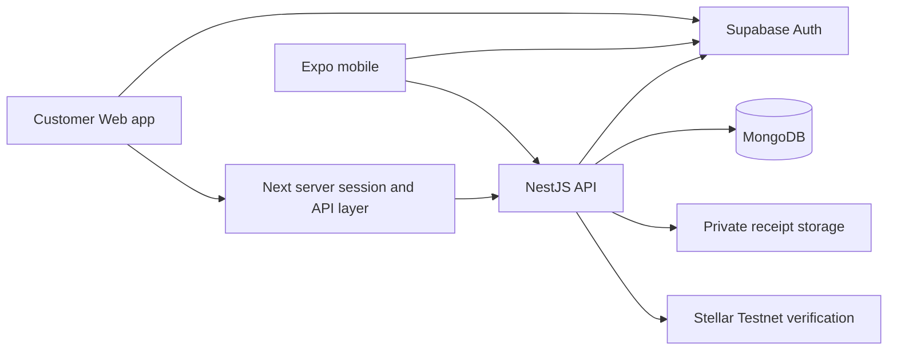

# SAVE Web implementation plan

Status: first Web implementation slice delivered locally; subsequent phases remain planned. Scope confirmed by the user: **personal and business accounts**, with **email/password, Google and email magic-link sign-in**. No Web product has been deployed by this work.

## Implemented first slice

The dedicated `web/` app now uses Next.js 16.3.6 and React 19.2.8. See [local setup](../web/README.md).

- Server-side email/password, Google, magic-link and recovery flows; verified provider identity, HttpOnly session cookies, protected pages and server actions.
- Personal/business workspace creation and switching, with backend active-membership checks and owner/admin/finance/member/viewer permissions.
- Integer-minor-unit transactions with create/read/edit/delete, mutation IDs, revision conflicts, date validation, URL filters and 25-record pagination.
- Responsive overview, transaction screens, category reports and summary CSV export. Totals cover all matching records, not only the current page.
- Permission-policy/service tests and amount/filter tests. Browser qualification uses isolated local auth/API fixtures; live provider and database integration remain release gates.

This slice uses embedded memberships, category labels and page-number pagination. Invitations, category entities, cursor pagination, shared domain packaging, approvals, audit history, budgets, savings and receipt uploads remain future work. Business users can currently track records; team administration is not exposed.

**Migration boundary:** new Web records use `workspace_transactions`. Existing mobile user-scoped records remain intact and are not yet shared with Web. A tested migration and mobile workspace integration must precede a shared-data release. No external provider configuration or deployment was performed.

## Currency support implemented

New Web personal/business workspaces can select from 23 currencies, including TWD (NTD), CNY and KRW. Workspace currency is immutable; existing records retain PHP. Entry, editing, summaries and CSV use currency-specific precision. Reports now offer current-rate conversion through CurrencyAPI, with provider timestamps, 60-second refresh, five-minute freshness enforcement and converted CSV metadata. Activation requires a configured minute-level API subscription. Saved records remain in their original workspace currency; historical-rate booking remains future work. See the supported list in `web/README.md`. Native mobile remains PHP until its separate data model is migrated.

## Product and architecture decision

Build a dedicated desktop-oriented Web application in `web/` using Next.js App Router, with responsive support down to mobile browsers. Reuse the NestJS API, hosted identity provider, finance calculations, validation contracts and design tokens. Keep the Expo application for native mobile and `admin/` for operator administration. The existing `admin/` homepage is a static prototype with hardcoded metrics; treating it as the customer product would mix authorization boundaries and preserve placeholder functionality.

The Expo browser export remains a development preview. It now has a browser storage adapter, but a desktop product needs URL-driven filters, accessible tables, keyboard workflows, secure server session handling and organization authorization. These are deliberate Web work, not a viewport enlargement of the phone UI.

At scaffolding time, pin a compatible Next.js/React/Node set and read that exact installed version's documentation. This repository's admin is currently Next.js 16.3.1. Reviewed local guides: `admin/node_modules/next/dist/docs/01-app/02-guides/authentication.md` and `01-app/01-getting-started/05-server-and-client-components.md`.

## Workspace model: implement before business screens

A person has one identity and can belong to multiple workspaces. Personal/Business is a workspace switch, never a client-controlled role or a filter over the same records.

| Entity | Required fields and rules |
| --- | --- |
| Workspace | ID, kind (`personal`/`business`), name, base currency, timezone, owner, timestamps; one default personal workspace per identity |
| Membership | workspace ID, user ID, role, status; unique workspace/user; verified membership required on every workspace route |
| Invitation | workspace, email, role, hashed single-use token, expiry, inviter, accepted timestamp; invitation acceptance is atomic |
| Transaction | workspace ID, creator, type, integer minor-unit amount, currency, local transaction date, category ID, merchant, receipt IDs, revision, mutation ID |
| Budget | workspace ID, category ID, period and effective dates, amount; uniqueness per applicable category/period; historical limits must not change silently |
| Savings goal | workspace ID, target/date, tracker or Testnet vault kind; public wallet and verified ledger state remain separate from manual progress |
| Receipt | workspace ID, owner/transaction reference, object key, media type, size, upload state, retention metadata |
| Approval | transaction ID, requester, assigned reviewer, state, reason, timestamps; server-enforced transitions |
| Audit event | workspace ID, actor, action, affected entity, prior/new revision, timestamp; append-only |

Current personal APIs are user-scoped. Migrate to workspace-scoped endpoints before introducing business access. Backfill existing owned records to their owner's personal workspace through an idempotent migration with dry-run counts, a database backup and rollback instructions. Do not auto-claim legacy demo/ownerless records.

## Roles and authorization

| Capability | Owner | Admin | Finance manager | Member | Viewer |
| --- | --- | --- | --- | --- | --- |
| Read workspace summaries | Yes | Yes | Yes | Own submissions plus explicitly shared summaries | Yes |
| Create expenses | Yes | Yes | Yes | Own submissions | No |
| Edit/delete | Workspace records under policy | Workspace records under policy | Finance records under policy | Own drafts only | No |
| Approve/reject | Yes, no self-approval by default | Yes, no self-approval | Yes, no self-approval | No | No |
| Manage budgets/categories | Yes | Yes | Yes | No | No |
| Manage members | Yes | Non-owner roles only | No | No | No |
| Transfer ownership/delete workspace | Yes | No | No | No | No |

Enforce these permissions in NestJS and its database filters. Hidden buttons are only presentation. Separate platform administration from workspace administration. Personal workspaces bypass the business approval workflow.

Proposed approval states: draft → submitted → approved/rejected; rejection requires a reason; editing an approved expense creates a revision and resubmission. Whether rejected records appear in reporting is explicit; they are excluded from actual spend by default. Record every transition and prohibit reviewer self-approval unless an explicit workspace policy allows it.

## Web screens and interaction design

Desktop shell: persistent sidebar, workspace switcher, page title/breadcrumb, period selector, contextual primary action, profile menu. Collapse the sidebar on smaller widths. Keep the established navy/blue palette, use a consistent icon library, readable 14–16px body text, visible focus outlines and larger money values. Centralize spacing, colors, typography, input, button, dialog and table tokens.

| Route | Personal experience | Business additions |
| --- | --- | --- |
| `/sign-in`, `/sign-up`, `/auth/callback` | All three sign-in methods, confirmation and recovery | Invitation-aware onboarding |
| `/w/[id]/overview` | Selected-period balance, income, expenses, budget remaining, recent activity | Team spending, awaiting approval, department/project summaries |
| `/w/[id]/transactions` | Search, date/category/type filters, sorting, pagination, detail drawer | Submitter, project, approval filters; authorized bulk actions |
| `/w/[id]/transactions/[transactionId]` | Receipt preview, edit, history and deletion confirmation | Approval actions, comments, revision history |
| `/w/[id]/budgets` | Category limits, remaining/overspent amounts, period history | Team/project budgets and permission-aware changes |
| `/w/[id]/savings` | Manual goals and optional Testnet vaults in separate views | Workspace goals only after ownership/signing policy is defined |
| `/w/[id]/reports` | Category/merchant comparisons and filtered exports | Team/project dimensions and approval-aware reporting |
| `/w/[id]/receipts` | Drag/drop, preview, link to transaction | Review queue and retention controls |
| `/w/[id]/members` | Not shown | Invitations, roles, remove/suspend members |
| `/w/[id]/settings` | Profile, currency/timezone, imports/exports | Workspace policy and audit log |

Filters live in query parameters so views survive reloads and can be shared with authorized members. Show totals for the filtered dataset, not only the loaded page. Virtualize large tables only after measuring; server pagination and aggregate endpoints come first. Dialogs restore focus, keyboard actions have visible alternatives, charts expose text summaries and status is never communicated by color alone.

## Authentication and session work

Reuse the configured Supabase project. Implement Web sessions through server-side handling of the authorization-code callback and protected same-origin API calls. Keep privileged provider credentials on the server. Final cookie/session design must follow the chosen provider's current SSR guidance; do not assume the mobile localStorage adapter is the Web architecture.

Include password recovery, email confirmation, logout, session expiry, provider cancellation, invitation redirects, same-device PKCE messaging, CSRF defenses for cookie-authenticated mutations, and explicit allowlists for redirects. Account linking should follow provider-supported verified-email behavior and must be tested across the three methods. Live Google/email qualification requires the external configuration described in `AUTH_SETUP.md`.

## API and data work

1. Add `/workspaces`, memberships/invitations and a membership/role authorization layer.
2. Introduce `/workspaces/:id/transactions`, budgets, categories, goals and reports. Scope every query, mutation and uniqueness constraint to the workspace.
3. Use integer minor units for fiat amounts with validated currency precision. Plan and test the migration from existing floating-point PHP values. Keep Stellar atomic units/decimal strings separate.
4. Add cursor pagination, validated filters, explicit timezone semantics and server-side aggregate/report endpoints.
5. Require client mutation IDs for retried writes; use database uniqueness and revision checks. Return structured validation/conflict errors and support optimistic updates with rollback.
6. Add private object storage uploads with short-lived signed URLs, server-side workspace authorization, type/size validation and download authorization. Local phone receipt URIs must never be represented as cross-device attachments.
7. Make imports asynchronous jobs with preview, column mapping, duplicate review, per-row results, retry checkpoints and audit entries. Export only the requested filters and authorized workspace; a complete backup must include a receipt manifest and a restorable file archive.
8. Add approval transitions, audit history and notification preferences. Build recurring transactions as schedules with idempotent occurrence generation; the current recurring boolean is only a label.
9. Preserve Stellar Testnet-only external signing and independent finality checks. A team member's permission to view a workspace must not imply wallet signing authority. Keep business vault creation disabled until signer policy is explicit.

## Implementation sequence and exit criteria

| Phase | Deliverable | Exit criteria |
| --- | --- | --- |
| 0 — Qualify current foundations | Configure Auth; run native account/offline/receipt checks; reconcile migration strategy | Real sign-in works; two-account access denied correctly; retry after lost response produces one record |
| 1 — Workspace API | Workspace/membership models, migration, permission tests, workspace routes | A personal account and two businesses remain isolated across every CRUD/report endpoint; unauthorized roles return 403/404 |
| 2 — Web foundation | `web/` app, server auth/session integration, shell, workspace switcher, shared domain package | Email/password, Google and magic links work; switching workspace invalidates all workspace queries; deep links and refresh preserve scope |
| 3 — Personal workflows | Overview, transactions, budgets, goals, reports, real uploads | One complete create → receipt → budget/report → edit/delete flow passes in browser; aggregate totals agree with API fixtures |
| 4 — Business workflows | Invitations/roles, submission/approval, project/team filters, audit trail | Owner/admin/finance/member/viewer matrix passes; concurrent approval/edit conflicts do not overwrite data |
| 5 — Data operations and release | Import/export jobs, recurring schedules, accessibility, performance, observability | Import interruption resumes without duplicates; backup restore roundtrip checked; keyboard and screen-reader review complete; release checklist satisfied |

Build and review each phase as a focused change. Suggested first Web implementation slice: create personal/business workspaces → switch workspaces → list/create a transaction in the selected workspace, backed by permission tests. This proves the shared data model before investing in all screens.

## Test and release gates

- Unit tests: cents/rounding, calendar boundaries, report aggregates, approval state machine, import normalization, role matrix.
- API integration tests against a disposable database: cross-workspace ID attacks, membership revocation, invitation reuse/expiry, idempotent writes after lost response, concurrent edits, signed receipt access.
- Browser E2E: real configured test accounts for every sign-in method; personal/business switch; member submits and reviewer approves; upload/download; import interruption; filtered CSV export; sign-out with pending requests.
- Accessibility: full keyboard navigation, focus in dialogs/drawers, labels/errors, large text, contrast and text alternatives for charts.
- Performance: validate paginated lists and report queries using at least 10,000 seeded records per workspace; establish budgets from measured baselines before release.
- Operational checks: TLS, restricted production origins, secrets isolation, provider/database outage messaging, API error monitoring without receipt/credential leakage, backups and migration rollback rehearsal.

## Scope boundaries

Web MVP includes both personal and business workspaces. It does not claim bank synchronization, tax filing, real-value Stellar custody, Mainnet, OCR, payroll, invoicing or currency conversion. OCR can follow receipt storage and a reviewed extraction workflow. Business vault signing governance, deployment domains, SMTP/Google configuration and final hosting remain explicit setup/product decisions; do not simulate them with placeholder success states.
